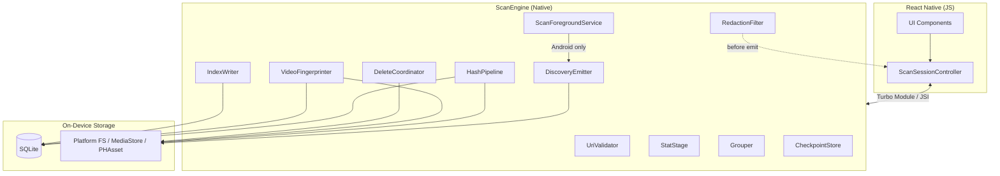
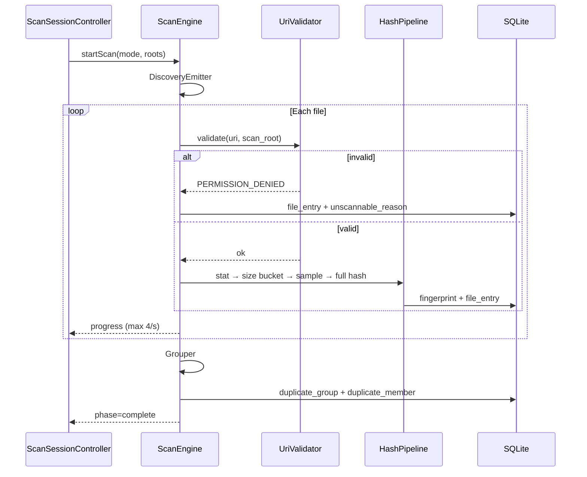
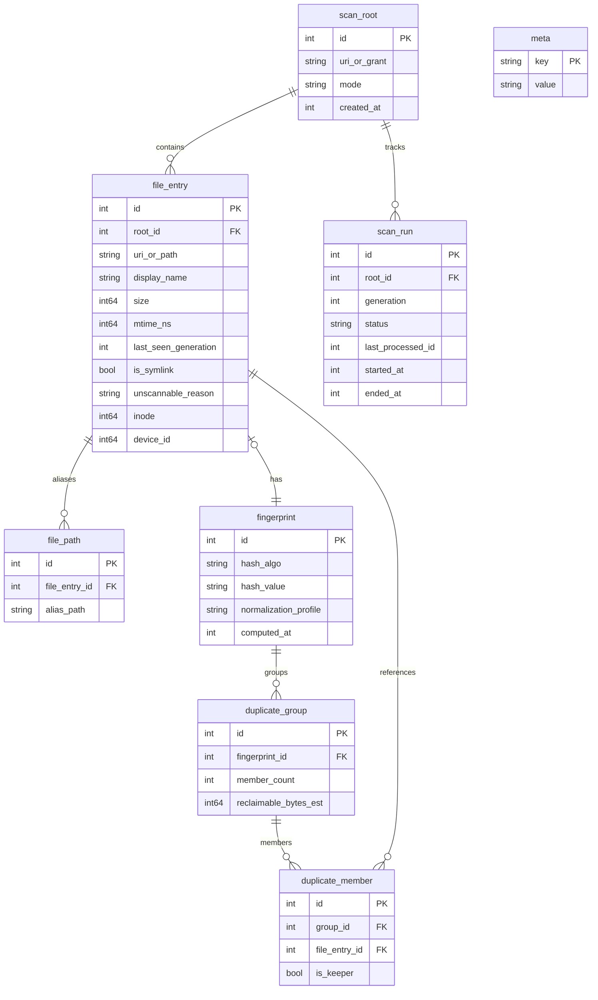

# DupBuster v1 — System Architecture

**Sources:** `.agent/results/dupbuster-debate-results.md`, `.agent/results/dupbuster-video-cross-resolution-debate-results.md`, `.agent/debate-floors/dupbuster-debate.md`, `.agent/debate-floors/dupbuster-video-cross-resolution-debate.md`  
**Companion:** `requirements.md`, `implementation-plan.md`

---

## 1. Architecture overview

DupBuster v1 is a **bare React Native** application with a native **ScanEngine** Turbo Module / JSI family. All file I/O, hashing, indexing, grouping, and platform delete operations run on native background executors. JavaScript owns scan session state, permission UX, and duplicate-group presentation.



**Key boundary rule:** Zero content bytes cross the JS bridge except throttled progress metadata (`filesProcessed`, `filesTotalKnown`, `groupsFound`, `reclaimableBytesEst`, `phase`).

---

## 2. Technology stack

| Layer | Choice | Rationale |
|-------|--------|-----------|
| Client framework | React Native bare workflow | FGS, custom Turbo Module, unconstrained filesystem APIs |
| Min OS | Android API 26, iOS 15 | RN support; scoped-storage era |
| Native module | ScanEngine Turbo Module / JSI | Performance; keep hashing off JS thread |
| Index | SQLite (single merged catalog) | Scale to tens of thousands of files |
| Hash algorithm | SHA-256 (streaming) | Content equivalence; BLAKE3 deferred |
| CI/CD | GitHub Actions + Fastlane | Tag-push matrix; internal/prod lanes |
| UI styling | StyleSheet + token JSON (`tokens.ts`) | No runtime theme switching v1 |

**Rejected for v1:** Expo managed workflow, `MANAGE_EXTERNAL_STORAGE`, cloud upload hashing.

---

## 3. Component architecture

### 3.1 React Native layer

| Component | Responsibility |
|-----------|----------------|
| **ScanSessionController** | Phase state machine; `coverageSessionKey` tracking; bridges native events to UI |
| **Permission flows** | Request/grant handling; drives `CoverageBanner` variant |
| **UI catalog** | CoverageBanner, ScanProgress, UnscannableSummaryCard, KeeperSelector, DeleteConfirmModal, etc. |
| **Accessibility layer** | Live-region announcements decoupled from 4 Hz native feed |

**Scan phase enum (JS ↔ native):**

`idle` → `discovering` → `hashing` → `grouping` → `complete` | `paused` | `error` | `cancelling` → `cancelled`

### 3.2 ScanEngine native module

| Submodule | Responsibility |
|-----------|----------------|
| **UriValidator** | Grant-boundary check; authority allowlist; fail-closed before I/O |
| **DiscoveryEmitter** | Enumerate files per scan mode A/B |
| **StatStage** | Size, mtime, inode/device_id, media type hint; for video: duration_ms, width, height (metadata) |
| **HashPipeline** | Size bucket → quick sample (> 50 MB) → full SHA-256 (`RAW_BYTES`) |
| **VideoFingerprinter** | **Video only:** compute `VIDEO_CONTENT_V1` (5-frame dHash) under caps; platform decoders only (no FFmpeg v1) |
| **Grouper** | Group by fingerprint; compute reclaimable bytes |
| **IndexWriter** | SQLite CRUD; generation/tombstone management |
| **CheckpointStore** | Resume from `last_processed_id` |
| **DeleteCoordinator** | Platform delete APIs; isolated from hash FD pool |
| **RedactionFilter** | Denylist regex before crash/analytics/bridge error emit |
| **ScanForegroundService** | Android FGS `dataSync`; notification lifecycle |

**Native pipeline flow:**



---

## 4. Fingerprint pipeline

### 4.1 Stages

| Stage | Condition | Action |
|-------|-----------|--------|
| 1. Discovery | Always | Emit path/uri, size, mtime, media_type hint, scan_root_id, generation |
| 2. Size bucket | Unique size in catalog | Skip further read (except `EMPTY:0`) **and except video** (video still runs `VIDEO_CONTENT_V1`) |
| 3. Quick sample | Size > 50 MB | SHA-256(first 64 KiB + last 64 KiB); mismatch → eliminate pair |
| 4. Full hash | Sample match or ≤ 50 MB | SHA-256 streaming, 1 MiB buffer (`RAW_BYTES`) |
| 4b. Video content | media_type=video | Compute `VIDEO_CONTENT_V1` (native `VideoFingerprinter`) in parallel with stage 4 |
| 5. Group | Hash/fingerprint complete | Exact match (`RAW_BYTES`) OR video content match (`VIDEO_CONTENT_V1`) |

### 4.2 Large-file and timeout policy

| Condition | Result |
|-----------|--------|
| Size > 2 GB, opt-in off | `LARGE_SKIPPED` |
| Size > 2 GB, opt-in on | Full hash attempted |
| Read exceeds 120 s | `HASH_TIMEOUT` |
| Zero bytes | Synthetic fingerprint `EMPTY:0` |

**Video content caps (VIDEO_CONTENT_V1):**
- Platform decoders only: Android MediaCodec + MediaExtractor; iOS AVAssetReader (no FFmpeg v1)
- 5 sampled frames (2%, 25%, 50%, 75%, 98%); <3 s uses single frame
- Downscale ≤ 320×180, grayscale, 64-bit dHash
- 90 s wall-clock per file for video fingerprinting
- 500 MB default budget; 2 GB with `settings.largeFiles` opt-in
- 32 MB container header/index parse cap before decode
- Max 1 active hardware decode session per process; when decoding active, batch size may drop to 8
- Failure maps to `VIDEO_DECODE_FAILED` (no crash)

### 4.3 Text normalization

For plain text files only:

1. Decode as UTF-8
2. Strip UTF-8 BOM
3. Normalize to NFC
4. Convert CRLF → LF
5. SHA-256 normalized bytes (trailing whitespace **not** trimmed)

Profile key: `TEXT_NFC_LF`

---

## 5. Data model (SQLite)

### 5.1 Entity relationship



### 5.2 Table definitions

#### `scan_root`

| Column | Type | Notes |
|--------|------|-------|
| `id` | INTEGER PK | |
| `uri_or_grant` | TEXT | SAF tree URI, bookmark ref, or mode marker |
| `mode` | TEXT | `user_selected` \| `platform_discovery` |
| `platform_reason` | TEXT | e.g. `ANDROID_SCOPED`, `IOS_LIMITED_PHOTOS`, `SAF_TREE_ONLY` |
| `created_at` | INTEGER | Unix ms |

#### `file_entry`

| Column | Type | Notes |
|--------|------|-------|
| `id` | INTEGER PK | |
| `root_id` | INTEGER FK | → `scan_root.id` |
| `uri_or_path` | TEXT | Primary identifier |
| `display_name` | TEXT | Truncated for display; never used in I/O |
| `size` | INTEGER | Bytes |
| `mtime_ns` | INTEGER | Nanoseconds |
| `fingerprint_id` | INTEGER FK nullable | Null if unscannable |
| `last_seen_generation` | INTEGER | Scan generation |
| `is_symlink` | INTEGER | 0/1 |
| `unscannable_reason` | TEXT nullable | Enum string |
| `inode` | INTEGER nullable | Hard-link detection |
| `device_id` | INTEGER nullable | Hard-link detection |
| `duration_ms` | INTEGER nullable | Video metadata (duration gate/bucketing) |
| `video_width` | INTEGER nullable | Video metadata |
| `video_height` | INTEGER nullable | Video metadata |

#### `file_path` (aliases)

| Column | Type | Notes |
|--------|------|-------|
| `id` | INTEGER PK | |
| `file_entry_id` | INTEGER FK | |
| `alias_path` | TEXT | Additional path/URI for same inode |

#### `fingerprint`

| Column | Type | Notes |
|--------|------|-------|
| `id` | INTEGER PK | |
| `hash_algo` | TEXT | `SHA256` |
| `hash_value` | TEXT | Hex digest or `EMPTY:0` |
| `normalization_profile` | TEXT | `TEXT_NFC_LF`, `RAW_BYTES`, `VIDEO_CONTENT_V1`, `EMPTY:0` |
| `computed_at` | INTEGER | Unix ms |
| `frame_hashes_blob` | BLOB nullable | Debug-only; never in prod telemetry; gated by build flag |

#### `duplicate_group`

| Column | Type | Notes |
|--------|------|-------|
| `id` | INTEGER PK | |
| `fingerprint_id` | INTEGER FK | |
| `member_count` | INTEGER | |
| `reclaimable_bytes_est` | INTEGER | Sum non-keeper sizes (updated on delete preview) |
| `match_kind` | TEXT | `EXACT_BYTES` \| `SAME_CONTENT_VIDEO` |
| `confidence_score` | REAL nullable | 1.0 exact; 0.95 content default |

#### `duplicate_member`

| Column | Type | Notes |
|--------|------|-------|
| `id` | INTEGER PK | |
| `group_id` | INTEGER FK | |
| `file_entry_id` | INTEGER FK | |
| `is_keeper` | INTEGER | 0/1; set at delete time |

#### `scan_run`

| Column | Type | Notes |
|--------|------|-------|
| `id` | INTEGER PK | |
| `root_id` | INTEGER FK nullable | Null for merged multi-root runs |
| `generation` | INTEGER | Incremental scan generation |
| `status` | TEXT | `running`, `paused`, `cancelling`, `cancelled`, `complete`, `error` |
| `last_processed_id` | INTEGER | Checkpoint for resume |
| `started_at` | INTEGER | |
| `ended_at` | INTEGER nullable | |
| `teardown_reason` | TEXT nullable | e.g. `FORCE_TIMEOUT` |

#### `meta`

| Key | Value | Notes |
|-----|-------|-------|
| `schema_version` | INTEGER | Independent of app semver |
| `full_rescan_required` | 0/1 | Set on algo/normalization change |

### 5.3 Schema versioning

- `schema_version` in `meta` table tracks fingerprint algorithm and normalization profile changes
- On bump: set `full_rescan_required = 1`; show `RescanPromptBanner`
- App semver and `schema_version` are independent
- Support KB: do not downgrade app across schema migrations

**Schema v2 amendment (video cross-resolution):**
- Adds `VIDEO_CONTENT_V1`, video metadata fields, `match_kind`, and `VIDEO_DECODE_FAILED`
- Upgrade requires full rescan to populate new fingerprints and grouping

---

## 6. Scan orchestration

### 6.1 Scan modes

**Mode A — User-selected root**

- Trigger: SAF / DocumentPicker folder pick
- Creates isolated `scan_root` row
- Scans subtree only via grant-boundary validation

**Mode B — Default / all accessible**

- Trigger: User starts scan without folder selection
- Android: MediaStore union (images, video, audio, downloads) + optional SAF tree
- iOS: PHAsset fetch + security-scoped bookmarks
- **Not** a recursive walk of `/sdcard` or equivalent without grants

### 6.2 Incremental scan

1. Increment `generation` on new `scan_run`
2. For each discovered file: compare size/mtime to index
3. New or changed → re-hash
4. Missing from discovery → tombstone
5. After successful run → purge tombstones

### 6.3 Resume and checkpoint

- Persist `last_processed_id` during run
- Process kill → on relaunch offer resume (same `scan_run`) or restart
- No conflicting `scan_run` rows for same paths/generation

### 6.4 Integrity (TOCTOU)

| Event | Behavior |
|-------|----------|
| Size/mtime changes stat → hash | Discard hash, re-queue |
| File deleted mid-hash | Tombstone member; continue run |
| Permission revoked | Pause run; close FDs for revoked roots; show partial results |
| User cancel | `CANCELLING` → drain 30 s → stop FGS → `cancelled` |

### 6.5 Progress contract

**Native → JS (max 4 events/s):**

```typescript
interface ScanProgressEvent {
  filesProcessed: number;
  filesTotalKnown: number | null;
  groupsFound: number;
  reclaimableBytesEst: number;
  phase: ScanPhase;
  contentKind?: "none" | "video_content";
}
```

**JS → assistive tech (independent cadence):**

- Announce when `filesProcessed` delta crosses 10% of `filesTotalKnown` OR 500 files
- Phase terminal announcements on every transition

---

## 7. Platform-specific notes

### 7.1 Android

| Topic | Implementation |
|-------|----------------|
| Discovery | MediaStore queries + SAF tree |
| File access | `ContentResolver.openFileDescriptor(uri, "r")` |
| SAF validation | `DocumentsContract.buildDocumentUriUsingTree`; reject `..` in docId |
| Delete | `MediaStore.createDeleteRequest` (API 30+) / platform delete APIs |
| Background | FGS type `dataSync`; channel `com.dupbuster.scan.foreground.v1` |
| Broad access | **No** `MANAGE_EXTERNAL_STORAGE` in v1 |

**FGS cancel teardown:**

1. Set status `CANCELLING`; stop enqueue
2. Cancel in-flight reads (5 s per-file cap)
3. Drain executor ≤ 30 s
4. `stopForeground(STOP_FOREGROUND_REMOVE)` + cancel notification
5. Persist `cancelled`; `onDestroy` always cancels notification ID

### 7.2 iOS

| Topic | Implementation |
|-------|----------------|
| Discovery | PHAsset fetch + security-scoped bookmarks |
| File access | `NSFileCoordinator` + scoped resource access |
| PHAsset validation | `localIdentifier` from platform fetch only |
| Delete | `PHAssetChangeRequest` |
| Background | BGProcessingTask continuation only; primary scan foreground |
| Limited library | Scan authorized identifiers only; `limited-library` banner |

---

## 8. Security architecture

### 8.1 UriValidator

**Mandatory before stat/open/hash.**

| Rule | Detail |
|------|--------|
| API-only resolution | No string concatenation or manual path parsing |
| Grant boundary | Every URI must resolve under active `scan_root` |
| Authority allowlist | MediaStore URIs from discovery queries only; SAF from picker/grant; no user-pasted URIs |
| Fail-closed | Validation failure → `PERMISSION_DENIED`; no retry with elevated scope |
| Symlinks | Do not follow |

### 8.2 RedactionFilter

All strings to crash SDK, opt-in analytics, and JS bridge errors pass `RedactionFilter.apply()`.

**Denylist regex patterns:**

1. `(?i)(/storage/|/sdcard/|/data/user/|/var/mobile/|/private/var/)`
2. `(?i)content://[^\s\"']+`
3. `(?i)file://[^\s\"']+`
4. `(?i)(ph://|assets-library://)[^\s\"']+`
5. `(?i)([A-Za-z]:\\Users\\|/Users/|/home/)[^\s\"']+`
6. Path-like segments ending in media extensions with preceding slash/backslash
7. Redact `uri_or_path`, `display_name`, alias paths in crash payloads

**Allowed telemetry fields (opt-in only):** `scan_run` id, phase, counts, `schema_version`, `teardown_reason`, platform API level, anonymized exception type (no denylist-matching message body).

### 8.3 Delete isolation

- Hash phase: read-only FDs only; no write/truncate/delete syscalls
- Delete phase: separate `DeleteCoordinator`; platform APIs after two-step JS confirm
- No secure wipe; platform default deletion semantics

---

## 9. UI architecture

### 9.1 Component catalog

| Component | Key props / behavior |
|-----------|---------------------|
| `CoverageBanner` | `variant`, `coverageSessionKey`, `firstDisplayAlertEligible`, `dismissedForSession` |
| `ScanProgress` | `phase`, progress counters, sticky pause/cancel footer |
| `ScanStatusChip` | Header mirror of scan state (iOS parity) |
| `UnscannableSummaryCard` | Row per `unscannable_reason`; CTAs for LARGE_SKIPPED, HASH_TIMEOUT |
| `DuplicateGroupListItem` | Thumbnail grid max 4 + overflow; reclaimable size |
| `MatchKindBadge` | Shows `EXACT_BYTES` vs `SAME_CONTENT_VIDEO` |
| `KeeperSelector` | Presets: largest, newest, shortest path; radiogroup a11y |
| `KeeperEducationSheet` | Once per session |
| `DeleteConfirmModal` | Two-step; focus trap |
| `PathChipList` | Multi-path aliases under member |
| `TextFileBadge` | Text file indicator |
| `RescanPromptBanner` | When `meta.full_rescan_required` |
| `ContentMatchNotice` | Shown on `SAME_CONTENT_VIDEO` group detail; compare-before-delete trust copy |

### 9.2 Design tokens

Three layers:

1. **Global semantic** — color, spacing, radius, typography, elevation
2. **Component** — `ScanProgress.height`, `CoverageBanner.minHeight`, `touchTargetMin=44dp`
3. **Platform** — notification icon, haptic on delete confirm (iOS)

Partial permission uses `color.surface.caution` (not danger). Danger reserved for delete confirmation.

### 9.3 Accessibility tokens (a11y.*)

| Token | Value |
|-------|-------|
| `a11y.coverage.dismiss` | "Dismiss coverage notice" |
| `a11y.coverage.dismissHint` | "Hides this notice until next app launch" |
| `a11y.coverage.settingsHint` | "Opens system settings" |
| `a11y.scan.progress` | "{percent} percent, {filesProcessed} files scanned, {groupsFound} duplicate groups found" |
| `a11y.scan.discovering` | "Scanning, discovering files" |
| `a11y.scan.complete` | "Scan complete" |
| `a11y.scan.paused` | "Scan paused" |
| `a11y.scan.error` | "Scan stopped with errors" |
| `a11y.scan.cancelling` | "Cancelling scan" |
| `a11y.scan.cancelled` | "Scan cancelled" |
| `a11y.scan.pause` | "Pause scan" |
| `a11y.scan.cancel` | "Cancel scan" |
| `a11y.keeper.group` | "Choose file to keep" |
| `a11y.scan.videoContent` | "Analyzing video content" |
| `a11y.group.exact` | "Identical files, {count} copies" |
| `a11y.group.videoContent` | "Same video at different quality, {count} files" |

Additional match-kind UI strings (EN freeze): `match.exact.label`, `match.videoContent.label`, `match.videoContent.notice`, `scan.phase.videoContent`, `keeper.education.videoContent`.

---

## 10. Background and battery

| Platform | Policy |
|----------|--------|
| Android | FGS `dataSync`; ongoing notification for scan lifetime; throttle on low battery/thermal |
| iOS | Foreground-primary scan; BGProcessingTask for continuation only; `ScanStatusChip` in-app |
| Both | Batch size 32 files; yield on thermal/battery APIs |

---

## 11. Bridge contracts

### 11.1 Progress events (native → JS)

- Max 4 events/s; 250 ms coalesce window
- Fields only: `filesProcessed`, `filesTotalKnown`, `groupsFound`, `reclaimableBytesEst`, `phase`, optional `contentKind` enum
- **No** file content or paths

### 11.2 Error events (native → JS)

```typescript
interface ScanErrorEvent {
  file_entry_id: number;
  unscannable_reason: UnscannableReason;
  scan_run_id?: number;
}
```

**Never** include `uri_or_path`. RN maps `PERMISSION_DENIED` to `CoverageBanner` denied variant.

### 11.3 Delete commands (JS → native)

- Invoked only after two-step confirm
- Payload: `group_id`, `keeper_file_entry_id`, member IDs to delete
- `DeleteCoordinator` uses platform APIs; isolated from hash pipeline

---

## 12. Directory structure (proposed)

```
dupbuster/
├── android/                    # Native Android project
│   └── app/src/main/java/.../scanengine/
├── ios/                        # Native iOS project
│   └── ScanEngine/
├── src/
│   ├── components/             # UI catalog
│   ├── controllers/            # ScanSessionController
│   ├── tokens/                 # tokens.ts
│   ├── screens/
│   └── types/
├── tests/
│   └── fixtures/dupbuster/v1/  # Hash fixture matrix
└── .github/workflows/          # CI matrix
```

---

## 13. References

- Requirements: `.agent/deliverables/dupbuster/requirements.md`
- Implementation plan: `.agent/deliverables/dupbuster/implementation-plan.md`
- Results: `.agent/results/dupbuster-debate-results.md`
