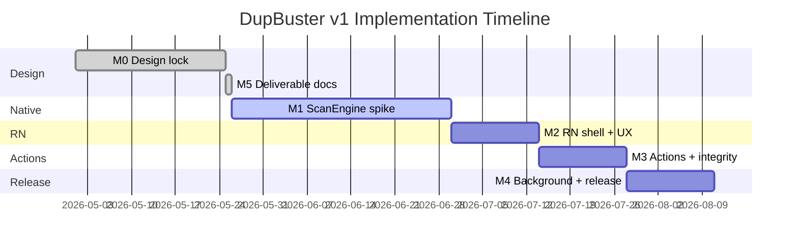
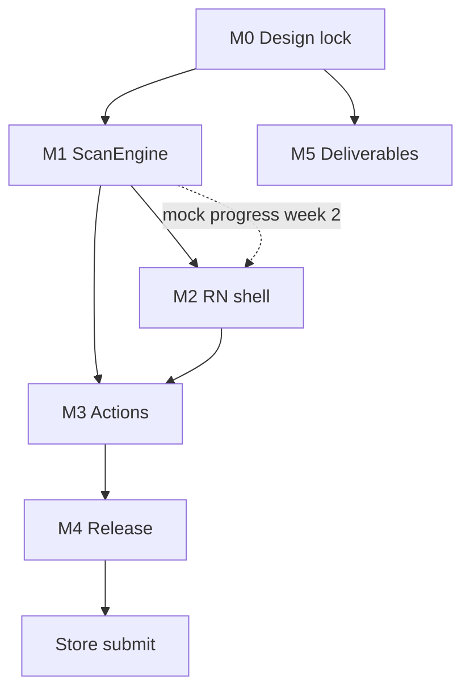

# DupBuster v1 — Implementation Plan

**Sources:** `.agent/results/dupbuster-debate-results.md`, `.agent/debate-floors/dupbuster-debate.md`  
**Companion:** `requirements.md`, `architecture.md`  
**M0 status:** Design package locked (debate close complete)

---

## 1. Executive summary

DupBuster v1 ships as a bare React Native app with a native ScanEngine module. Implementation proceeds in five milestones (M1–M5) after M0 design lock. **ScanEngine is the critical path** for M1–M4; the RN UI shell can stub against mock progress until the native bridge is live (~M1 week 2).

**Estimated M1 spike duration:** 3–5 weeks for native ScanEngine reference (includes VIDEO_CONTENT_V1 VideoFingerprinter amendment) on Android API 26+ and iOS 15+.

---

## 2. Milestone overview



| Milestone | Duration (est.) | Depends on | Exit criteria |
|-----------|-----------------|------------|---------------|
| **M0** | Complete | Debate consensus | All agents satisfied on design package |
| **M1** | 3–5 weeks | M0 | Discovery + staged hash + SQLite + progress throttle + checkpoint; plus VIDEO_CONTENT_V1 VideoFingerprinter + schema v2; QA fixtures green |
| **M2** | ~2 weeks | M1 week 1 (parallel stub OK) | CoverageBanner, ScanProgress, UnscannableSummaryCard, KeeperSelector; plus match_kind badges/notices + a11y smoke |
| **M3** | ~2 weeks | M2 | Platform delete APIs, two-step confirm, TOCTOU suite, permission-revoke pause |
| **M4** | ~2 weeks | M3 | Android FGS, RedactionFilter CI green, store checklist, Play pre-launch / TestFlight external |
| **M5** | Complete | M0 | requirements.md, architecture.md, implementation-plan.md authored |

---

## 3. M1 — Native ScanEngine spike

**Goal:** Prove discovery, staged hashing, SQLite indexing, and progress bridge on both platforms.

### 3.1 Tasks

| # | Task | Platform | Owner hint |
|---|------|----------|------------|
| M1-01 | Scaffold bare RN project with android/ and ios/ native dirs | Both | Mobile lead |
| M1-02 | Define ScanEngine Turbo Module / JSI interface | Both | Architect |
| M1-03 | Implement UriValidator (grant boundary, allowlist) | Both | Native |
| M1-04 | Implement DiscoveryEmitter mode A (SAF/DocumentPicker) | Both | Native |
| M1-05 | Implement DiscoveryEmitter mode B (MediaStore / PHAsset) | Both | Native |
| M1-06 | Implement StatStage (size, mtime, inode/device_id) | Both | Native |
| M1-07 | Implement HashPipeline (size bucket → sample → full SHA-256) | Both | Native |
| M1-08 | Implement text normalization (`TEXT_NFC_LF`) | Both | Native |
| M1-09 | Implement SQLite schema + IndexWriter | Both | Native |
| M1-10 | Implement Grouper + duplicate_group/member writes | Both | Native |
| M1-11 | Implement progress throttle (4 Hz / 250 ms coalesce) | Both | Native |
| M1-12 | Implement CheckpointStore (resume) | Both | Native |
| M1-13 | Implement VIDEO_CONTENT_V1: native VideoFingerprinter (5-frame dHash + duration gate + caps) | Both | Engineering |
| M1-14 | Implement video pipeline exception (skip size-bucket elimination for video; duration pre-bucket) | Both | Engineering |
| M1-15 | Implement schema v2 migration + `match_kind` + `VIDEO_DECODE_FAILED` unscannable reason | Both | Engineering |
| M1-16 | Extend progress bridge with optional `contentKind` enum (`none` \| `video_content`) with ≤4 Hz | Both | Native |
| M1-17 | Create fixture matrix under `tests/fixtures/dupbuster/v1/` | Both | QA + Native |
| M1-18 | Native unit tests: all equiv-* fixtures + video equiv fixtures green | Both | QA |
| M1-19 | ScanOrchestrator + live `startScan` progress bridge (Android + iOS) | Wire `ScanEngineModule` / `RCTNativeScanEngine`; catalog query in Phase B (`getCatalogSnapshot`) |

### 3.2 M1 exit gate

- [x] All fixture matrix rows pass native unit tests offline (no RN bridge)
- [x] Progress bridge emits ≤ 4 events/s under 10k synthetic load (AC-integrity-progress-01)
- [x] Hashing-phase progress supports `contentKind=video_content` (AC-integrity-progress-02) and contains no paths/hashes/bytes
- [x] Video pipeline exception: different-size videos still run VIDEO_CONTENT_V1 (AC-pipeline-video-01)
- [x] Video equivalence suite runs green on reference devices subset (AC-equiv-video-xres-01/03/04/08)
- [x] SQLite schema matches architecture doc; `schema_version` in meta table
- [x] Text, document, image, A/V, binary, empty, symlink fixtures validated
- [x] VIDEO_DECODE_FAILED handling covered in native fixtures (AC-security-decode-01/02)
- [x] Multi-stage pipeline: size skip, 50 MB+ sample, 2 GB cap, 120 s timeout

### 3.3 M1 parallel authorization

M2 RN shell stub work may begin after M1 week 1 using mock progress events matching the bridge contract.

---

## 4. M2 — RN shell + permission UX

**Goal:** Wire UI catalog, permission flows, and accessibility baseline.

### 4.1 Tasks

| # | Task | Notes |
|---|------|-------|
| M2-01 | Implement `tokens.ts` with EN + a11y freeze strings | Verbatim from requirements |
| M2-02 | Implement `CoverageBanner` (partial, denied, limited-library) | `coverageSessionKey` wiring |
| M2-03 | Implement `ScanProgress` + `ScanStatusChip` | Bind to native phase enum |
| M2-04 | Implement `UnscannableSummaryCard` | Row per reason code |
| M2-05 | Implement `DuplicateGroupListItem` + group detail screen | Thumbnail grid, reclaimable |
| M2-06 | Implement `KeeperSelector` + `KeeperEducationSheet` | Largest defaultHighlighted |
| M2-07 | Implement `ScanSessionController` | Phase state machine |
| M2-08 | Wire permission request flows | Android + iOS |
| M2-09 | Implement `RescanPromptBanner` | `full_rescan_required` hook |
| M2-10 | Automated a11y suite (react-native-a11y or equivalent) | Zero critical violations |
| M2-11 | Manual VoiceOver / TalkBack smoke matrix | QA executes; Accessibility signs off |
| M2-12 | Implement `MatchKindBadge` (EXACT_BYTES vs SAME_CONTENT_VIDEO) | RN UI |
| M2-13 | Implement `ContentMatchNotice` (polite on mount only for SAME_CONTENT_VIDEO) | RN UI + a11y |
| M2-14 | Wire progress subcopy token `scan.phase.videoContent` when `contentKind=video_content` | RN UI |

### 4.2 M2 exit gate

- [x] All catalog components render with frozen EN tokens
- [ ] AC-a11y-coverage-01 through AC-a11y-path-01 pass *(M2-scoped ACs green in Jest; `AC-a11y-delete-01` / `AC-a11y-path-01` blocked until M3-01/02)*
- [x] Automated a11y: zero critical violations on CoverageBanner (3 variants), ScanProgress, KeeperSelector *(DeleteConfirmModal deferred M3 — `it.todo` in gate suite)*
- [x] Video UX ACs: AC-ux-match-01/02; MatchKindBadge visible text not color-only *(plan IDs; satisfied by `MatchKindBadge` + `ContentMatchNotice` + `AC-a11y-match-02/03` tests)*
- [x] Accessibility ACs: AC-a11y-match-01 through AC-a11y-match-05 pass (notice timing + traversal order + badge label)
- [ ] Manual smoke: partial library, denied, progress cadence, cancel terminal announcement, delete modal focus, PathChipList multi-path, 200% font scale dismiss/CTA *(matrix rows 01–17, 20, 34; QA sign-off §6 pending; rows 30–31 blocked M3)*
- [ ] Manual smoke: open SAME_CONTENT_VIDEO group detail and verify ContentMatchNotice polite announcement before delete *(M2-SMOKE-28; automated proxy green; device VO/TB sign-off pending)*
- [x] Mock progress stub replaced with live bridge where M1 complete *(both platforms wire live progress + catalog via orchestrator + Phase B `getCatalogSnapshot`; `App.tsx` uses native port)*

---

## 5. M3 — Actions + integrity

**Goal:** Platform delete, TOCTOU handling, permission-revoke pause.

### 5.1 Tasks

| # | Task | Notes |
|---|------|-------|
| M3-01 | Implement `DeleteConfirmModal` (two-step, focus trap) | |
| M3-02 | Implement `PathChipList` + hard-link alias display | |
| M3-03 | Implement `DeleteCoordinator` (native, isolated from hash) | |
| M3-04 | Android MediaStore deleteRequest integration | API 11+ |
| M3-05 | iOS PHAssetChangeRequest integration | |
| M3-06 | TOCTOU: stat→hash size/mtime change discard + re-queue | AC-integrity-toctou-* |
| M3-07 | TOCTOU: delete mid-hash tombstone | |
| M3-08 | Permission revoke mid-scan pause + FD close | AC-integrity-perm-01 |
| M3-09 | Process kill resume/restart prompt | AC-integrity-resume-01 |
| M3-10 | Reclaimable space calculation on group detail | |
| M3-11 | Settings: `settings.largeFiles` opt-in preference | |

### 5.2 M3 exit gate

- [ ] AC-action-keeper-01 through AC-action-reclaim-01 pass
- [ ] AC-integrity-toctou-01, toctou-02, perm-01, resume-01, hardlink-01 pass
- [ ] Delete never invoked without two-step confirm
- [ ] Keeper explicit selection enforced (including a11y)

---

## 6. M4 — Background + release hardening

**Goal:** Production-ready builds with store compliance and security CI gates.

### 6.1 Tasks

| # | Task | Notes |
|---|------|-------|
| M4-01 | Android ScanForegroundService (dataSync) | Channel `com.dupbuster.scan.foreground.v1` |
| M4-02 | FGS cancel teardown sequence | AC-integrity-cancel-01 |
| M4-03 | iOS BGProcessingTask continuation hook | Foreground-primary remains default |
| M4-04 | Implement RedactionFilter with denylist patterns 1–7 | |
| M4-05 | CI gate AC-security-redact-01 | Fail on path in crash payload |
| M4-06 | CI gate AC-security-uri-01 | Crafted SAF `..` docId |
| M4-07 | GitHub Actions matrix build on tag push | |
| M4-08 | Fastlane internal + prod lanes | |
| M4-09 | Play Data Safety + iOS Privacy Nutrition forms | On-device-only claims |
| M4-10 | Store-matrix QA: API 26/33/34 Android; iOS 15/17/18 | |
| M4-11 | Play pre-launch report clean | |
| M4-12 | TestFlight external beta complete | |
| M4-13 | Opt-in crash analytics default off | |
| M4-14 | Privacy policy URL (on-device processing) | |
| M4-15 | schema_version migration + rescan prompt golden test | |

### 6.2 M4 prod promote gates

All must pass before production store submit:

- [ ] Green AC-security-redact-01 + AC-security-uri-01 on prod candidate
- [ ] Green video security gates: AC-security-decode-01, AC-security-decode-02, AC-security-blob-01, AC-security-progress-01
- [ ] Green video equivalence AC matrix: AC-equiv-video-xres-01 through 10 (+05b)
- [ ] A11y automated + manual smoke signed off
- [ ] FGS cancel notification cleared ≤ 120 s (AC-integrity-cancel-01)
- [ ] Play pre-launch report clean API 26/33/34
- [ ] TestFlight external beta complete
- [ ] Fastlane prod lane unblocked

**Internal track builds (Play internal, TestFlight internal) authorized at M1–M3 without green redaction gate.**

---

## 7. Dependency graph



**Critical path:** M0 → M1 (ScanEngine + SQLite + hash fixtures) → M3 (integrity) → M4 (FGS + RedactionFilter + store gates)

**Parallel tracks:**

- M2 UI can start with mock bridge after M1 week 1
- M4 RedactionFilter implementation can proceed alongside M3
- Fixture scaffolding can start at M1 day 1

---

## 8. Team sequencing

| Phase | Engineering focus | QA focus | Design focus |
|-------|-------------------|----------|--------------|
| M1 | Native ScanEngine both platforms | Fixture matrix + native unit tests | Token spec review |
| M2 | RN shell + ScanSessionController | A11y automated + manual smoke | Component QA |
| M3 | DeleteCoordinator + TOCTOU | Integrity integration suite | Delete modal review |
| M4 | FGS + RedactionFilter + CI | Store matrix + security gates | Store screenshot/copy |

---

## 9. Testing strategy

### 9.1 Test pyramid

| Layer | Scope | When |
|-------|-------|------|
| Native unit | Hash fixtures per equivalence row | Every PR touching ScanEngine |
| Integration | TOCTOU, cancel, resume, hard links | M3 gate |
| RN component | UI catalog, a11y automated | M2 gate |
| E2E / manual | VoiceOver, TalkBack, store matrix | M2 + M4 |
| CI security | Redaction + URI validation | M4 prod gate |

### 9.2 Fixture matrix location

```
tests/fixtures/dupbuster/v1/
├── manifest.json
├── text/           # equiv-text-* fixtures
├── documents/      # equiv-doc-*
├── images/         # equiv-img-*
├── av/             # equiv-av-*
├── binary/         # equiv-binary-*
├── empty/          # equiv-empty-*
├── symlinks/       # equiv-symlink-*
├── pipeline/       # size skip, sample, large cap
└── security/       # AC-security-* fixtures
```

### 9.3 Device matrix (M4)

| Platform | Versions | Tests |
|----------|----------|-------|
| Android | API 26, 33, 34 | Scoped storage, FGS, cancel notification, SAF picker |
| iOS | 15, 17, 18 | Limited vs full photo library, PHAsset delete, scoped bookmarks |

### 9.4 Performance regression (non-blocking v1 ship)

- 10k file synthetic tree on Pixel 6a / iPhone 12 class
- Memory peak logged
- Progress events ≤ 4 Hz verified

---

## 10. Risk register (RAID)

| Type | Item | Mitigation | Owner | Status |
|------|------|------------|-------|--------|
| Risk | Play rejection (MANAGE_EXTERNAL_STORAGE, misleading notification) | Defer broad access; FGS copy rules; no "complete" until run ends | Release + Architect | Mitigated |
| Risk | Stale index after app upgrade/downgrade | `schema_version` + `full_rescan_required`; support KB | Engineering | Mitigated |
| Risk | Partial-library UX perceived as incomplete | CoverageBanner + marketing constraint | PM + Design | Mitigated |
| Risk | Orphan FGS notification after cancel | onDestroy cancel + FORCE_TIMEOUT at 30 s | QA M4 | Mitigated |
| Assumption | Bare RN + ScanEngine on critical path | No parallel Expo-managed track | Engineering | Accepted |
| Assumption | SHA-256 collision negligible | Document in schema; no special mitigation | Architect | Accepted |
| Dependency | EN string freeze before first store submit | Tokens frozen in requirements.md | PM | Complete |
| Residual | Zip/bomb stall during read-only hash | 120 s timeout + streaming; support KB | Security | Accepted |
| Residual | Malicious local file during hash | Read-only byte stream; no format parsing | Security | Accepted |

---

## 11. Release train

### 11.1 Versioning

| Artifact | Scheme | Notes |
|----------|--------|-------|
| App semver | MAJOR.MINOR.PATCH | User-facing releases |
| `schema_version` | Monotonic integer | Independent; bump on algo/normalization change |

### 11.2 Pipeline

1. PR → native unit tests + lint
2. Merge → integration tests
3. Tag push → GitHub Actions matrix build (Android + iOS)
4. Fastlane internal lane → Play internal + TestFlight internal
5. M4 gates green → Fastlane prod lane → Play production + App Store

### 11.3 Rollback

- Store rollback is binary-only
- Stale index after downgrade acceptable if `schema_version` monotonic
- Document: do not downgrade across schema migrations

### 11.4 Release notes template (schema bump)

> Rescan recommended — comparison rules changed in this update.

---

## 12. Store submission checklist

- [ ] Play Data Safety: files processed on-device only, not transmitted
- [ ] iOS Privacy Nutrition: Photo Library usage string matches limited-library UX
- [ ] Permission rationale strings from `denied.blocking` + `partial.*`
- [ ] Foreground service declaration: user-initiated duplicate scan on local storage
- [ ] Privacy policy URL explaining on-device-only processing
- [ ] Two-step delete confirm in app
- [ ] No forensic erasure claims in store listing or marketing
- [ ] Opt-in crash analytics default off
- [ ] Unscannable reason codes not sent off-device in v1 telemetry
- [ ] FGS notification channel stable: `com.dupbuster.scan.foreground.v1`
- [ ] No "delete" or "remove" in FGS channel name or ongoing notification

---

## 13. Post-v1 backlog (defer list)

Do not implement without new debate consensus:
1. Image perceptual / near-duplicate photos (resized/recompressed/cropped) + perceptual matching
2. Cross-format document dedup
3. Cloud upload hashing (opt-in)
4. `MANAGE_EXTERNAL_STORAGE` broad crawl
5. Symlink follow mode
6. Filesystem watchers
7. Payload-only A/V hashing
8. Account login / backend sync
9. Auto-delete without review
10. Secure wipe / forensic erasure
11. Runtime theme switching
12. BLAKE3 hash algorithm option

---

## 14. Definition of done (v1 ship)

- [ ] All M1–M4 exit gates pass
- [ ] All acceptance criteria in requirements.md verified
- [ ] M4 prod promote gates green
- [ ] Play production + App Store submit approved
- [ ] Support KB: schema migration, zip/bomb timeout, partial scan expectations

---

## 15. References

- Requirements: `.agent/deliverables/dupbuster/requirements.md`
- Architecture: `.agent/deliverables/dupbuster/architecture.md`
- Results: `.agent/results/dupbuster-debate-results.md`
- Debate floor: `.agent/debate-floors/dupbuster-debate.md`
